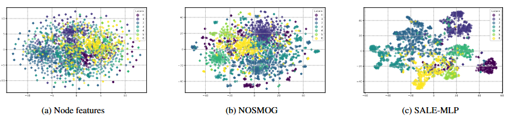
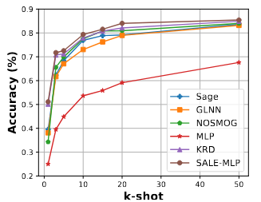
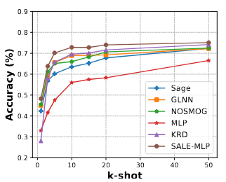

# 📘 SALE-MLP: Structure Aware Latent Embeddings for GNN to Graph-free MLP Distillation


[](https://creativecommons.org/licenses/by-nc/4.0/)


This repository hosts **supplementary material, analysis, and findings** for the IJCAI 2025 accepted paper:

> **SALE-MLP: Structure Aware Latent Embeddings for GNN to Graph-free MLP Distillation**  
> *Harsh Pal, Sarthak Malik, Rajat Patel, Aakarsh Malhotra*  
> **AI Garage, Mastercard, Gurugram, India**  
> [Paper PDF](./SALE_MLP_IJCAI_2025_MAIN.pdf) | [Supplementary PDF](./SALE_MLP_IJCAI_2025_SUPPLEMENTARY.pdf)

---

## 🧠 Overview

**SALE-MLP** proposes a new paradigm for **graph-to-MLP distillation (G2M)**. Unlike traditional methods, it enables:

- **Graph-free inference**: No access to graph structure at test time
- **Structure-aware learning**: Learns topology-aware latent embeddings using unsupervised losses
- **Task, loss, and teacher agnostic**: Generalizes across various architectures and tasks

This repository contains **exclusive insights and results** omitted from the main paper due to space constraints.

---

## 📊 Dataset Statistics

Six widely-used datasets were analyzed in depth:

| Metric         | Cora | Citeseer | Pubmed | A-Computer | A-Photo | OGBN-Arxiv |
|----------------|------|----------|--------|------------|---------|-------------|
| Nodes          | 2,485 | 2,110   | 19,717 | 13,381     | 7,487   | 169,343     |
| Edges          | 5,069 | 3,668   | 44,324 | 245,778    | 119,043 | 1,166,243   |
| Features       | 1,433 | 3,703   | 500    | 767        | 745     | 128         |
| Classes        | 7     | 6       | 3      | 10         | 8       | 40          |
| Heterophily %  | 15.7  | 20.5    | 16.2   | 21.7       | 16.8    | 32.2        |
| Mean Degree    | 5.08  | 4.48    | 5.5    | 37.7       | 32.8    | 14.77       |

---

## 📂 Supplementary Material Highlights

This repository includes key details **not available in the main paper**, such as:

- ✅ Detailed dataset statistics (heterophily ratios, class distributions)
- ✅ Hyperparameter grids across six datasets
- ✅ Inference efficiency and memory comparison vs. GNNs
- ✅ Visualizations: t-SNE plots of feature space separation
- ✅ Generalization across few-shot regimes (k-shot analysis)
- ✅ Heterophily-resilient performance
- ✅ Statistical significance tests (McNemar’s test)

---

## ⚙️ Hyperparameters Used

All hyperparameters were tuned per dataset. Highlights include:

| Dataset     | Layers | Dim | Walks | Walk Len | λ    | α     | Pretrain Epochs | Total Epochs |
|-------------|--------|-----|--------|-----------|------|-------|------------------|--------------|
| Cora        | 2      | 128 | 3      | 20        | 0.6  | 2.5   | 10               | 200          |
| Citeseer    | 2      | 128 | 3      | 20        | 0    | 2.5   | 10               | 200          |
| Pubmed      | 2      | 128 | 3      | 20        | 0.5  | 2.5   | 10               | 200          |
| A-Photo     | 2      | 128 | 2      | 10        | 0.1  | 2.5   | 10               | 200          |
| A-Computer  | 2      | 128 | 2      | 10        | 0    | 2.5   | 10               | 200          |
| OGBN-Arxiv  | 3      | 256 | 5      | 50        | 0    | 2.5   | 2                | 500          |

---

## 🔍 Key Experimental Highlights

### 🔧 Design Flexibility
- **Loss Agnostic**: SALE-MLP works with DeepWalk, Node2Vec, and LINE. Node2Vec gives best results.
- **Task Agnostic**: Supports link prediction beyond node classification.
- **Teacher Agnostic**: Works with GAT, GCN, SAGE and consistently outperforms all.

### 📉 Time & Space Complexity
- SALE-MLP avoids costly GNN message passing.  
  **Inference speedup**: Up to **150× faster** than GNNs.  
  **Memory**: Graph-free during inference.

---

## 📈 Extended Results (From Supplement)

### 📌 Link Prediction (Inductive)

| Model      | AUC / Accuracy (Cora) | AUC / Accuracy (Citeseer) |
|------------|------------------------|----------------------------|
| Teacher    | 0.945 / 88.5%          | 0.947 / 88.1%              |
| GLNN       | 0.88 / 81.2%           | 0.92 / 84.5%               |
| NOSMOG     | 0.93 / 86.9%           | 0.90 / 80.0%               |
| **SALE-MLP** | **0.96 / 90.9%**      | **0.98 / 94.8%**           |

---

### 📌 Heterophily Analysis

SALE-MLP maintains top-tier performance even as **heterophily ratios increase** (i.e., when neighboring nodes have differing labels). Unlike other G2M methods, SALE-MLP shows **graceful degradation**.

---

### 📌 Generalization (Few-Shot Learning)

SALE-MLP outperforms all baselines across **k-shot (low-label) learning scenarios**, showing:

- Steep improvement with small k
- Consistent gains over KRD and NOSMOG
- Robustness in data-scarce settings

---

### 📌 t-SNE Visualizations

SALE-MLP generates **well-separated class clusters**, as shown in latent space visualizations:

<p align="center">
  
  <br><em>Figure: t-SNE for Cora — SALE-MLP latent embeddings show clear separation.</em>
</p>

---

### 🔹 Few-Shot Learning (k-shot)


<p align="center">
    
    
</p>
<em>Figure: Accuracy vs. number of labeled examples (k)</em>
---

### 📌 Hyperparameter Sensitivity

SALE-MLP is **robust to λ and α changes**:

- Optimal λ ∈ [0.0, 0.6]
- Performance peaks at α ≈ 2.5

---

### 📌 Statistical Significance

Using **McNemar’s Test**, SALE-MLP is **statistically better** than the second-best G2M method across all datasets (p < 0.05).

---

## 📌 Summary of Strengths

| Dimension           | Description                                                                 |
|---------------------|-----------------------------------------------------------------------------|
| Inference Time      | Up to **150× faster** than SAGE GNN                                         |
| Generalization      | Excels in **low-label regimes** (few-shot learning)                         |
| Structure Awareness | High **min-cut consistency** and better **latent cluster separation**       |
| Heterophily Robust  | Performs best in high heterophily settings                                  |
| Teacher Agnostic    | Works with GAT, GCN, and SAGE with consistently top performance             |
| Task Flexibility    | Strong results on both classification and **link prediction**               |
| Loss Robustness     | Works with **DeepWalk, Node2Vec, LINE**, showing SALE-MLP is loss-agnostic  |

---

## 📚 Citation

If you find our work useful, please cite:

```bibtex
@inproceedings{sale_mlp_ijcai2024,
  title     = {SALE-MLP: Structure Aware Latent Embeddings for GNN to Graph-free MLP Distillation},
  author    = {Pal, Harsh and Malik, Sarthak and Patel, Rajat and Malhotra, Aakarsh},
  booktitle = {Proceedings of the International Joint Conference on Artificial Intelligence (IJCAI)},
  year      = {2025}
}

```

## 📄 License

This work is licensed under the  
**[Creative Commons Attribution-NonCommercial 4.0 International (CC BY-NC 4.0)](https://creativecommons.org/licenses/by-nc/4.0/)**

You are free to:

- **Share** — copy and redistribute the material in any medium or format  
- **Adapt** — remix, transform, and build upon the material

Under the following terms:

- **Attribution** — You must give appropriate credit  
- **NonCommercial** — You may not use the material for commercial purposes
